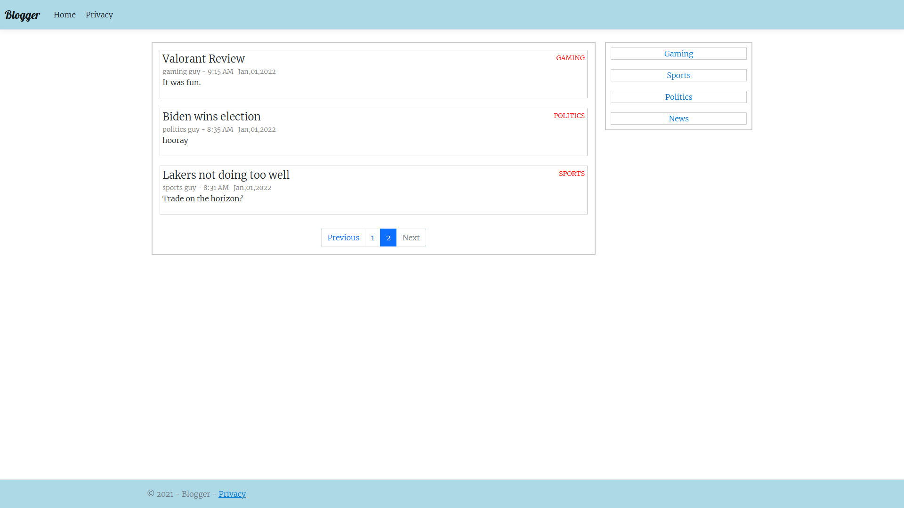

# Razor Pages Website
Forum/blog-type web application created with ASP.NET Core Razor Pages.

[Website Link](https://blogger20211231155421.azurewebsites.net)  
[Git Repo](https://github.com/collinc1212/razor_pages_website)  

## Details
* Uses Entity Framework Core and a MySQL database for storage
* Uses ASP.NET Core Razor Pages for HTML templating and application structure
* Hosted using Azure App Service

